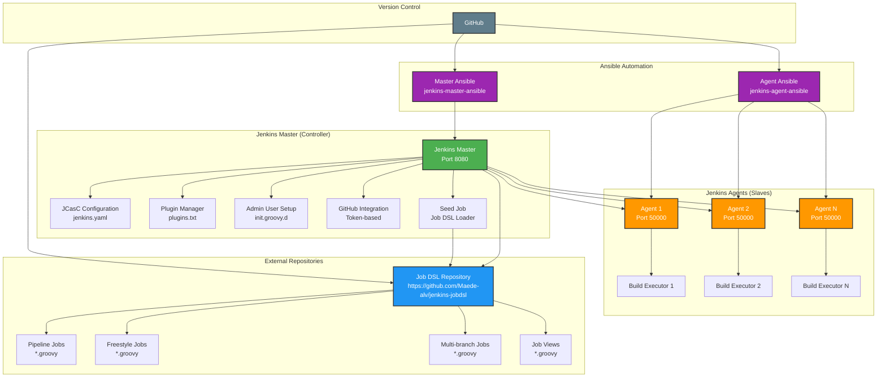

# Building a Modern Jenkins Infrastructure with Ansible: A Complete Guide

*Learn how to automate Jenkins deployment using Infrastructure as Code principles, Jenkins Configuration as Code (JCasC), and Job DSL for scalable CI/CD pipelines.*

---

## 🎯 What You'll Learn

By the end of this guide, you'll understand:
- How to implement **Infrastructure as Code** for Jenkins
- The power of **Jenkins Configuration as Code (JCasC)** for declarative configuration
- How **Job DSL** enables version-controlled job definitions
- Building a **distributed Jenkins architecture** with master and agents
- **Ansible automation** best practices for DevOps

---

## 🏗️ The Problem: Traditional Jenkins Setup

Traditional Jenkins installations often suffer from:
- **Manual configuration** that's hard to reproduce
- **Plugin management** chaos with version conflicts
- **Job definitions** scattered across the UI
- **No version control** for Jenkins configuration
- **Inconsistent environments** between development and production

Sound familiar? Let's solve these problems with modern DevOps practices.

---

## 💡 The Solution: Infrastructure as Code for Jenkins

We're going to build a Jenkins infrastructure that's:
- **Declarative**: Configuration defined in code
- **Version controlled**: Every change tracked in Git
- **Reproducible**: Deploy identical environments anywhere
- **Scalable**: Easy to add agents and distribute load
- **Maintainable**: Clear separation of concerns

---

## 🏛️ Architecture Deep Dive

Let's understand the architecture before diving into implementation:



### Key Concepts Explained

#### 1. **Jenkins Master (Controller)**
The Jenkins master is the brain of your CI/CD system. It:
- **Orchestrates builds** across multiple agents
- **Manages job definitions** and configurations
- **Handles authentication** and authorization
- **Coordinates plugin management**

#### 2. **Jenkins Configuration as Code (JCasC)**
JCasC is a revolutionary plugin that treats Jenkins configuration as code:
- **Declarative configuration** in YAML format
- **Version controlled** configuration changes
- **Environment consistency** across deployments
- **No more manual UI configuration**

#### 3. **Job DSL (Domain Specific Language)**
Job DSL allows you to define Jenkins jobs in Groovy scripts:
- **Infrastructure as Code** for job definitions
- **Version controlled** job configurations
- **Bulk job management** and updates
- **Consistent job patterns** across projects

#### 4. **Jenkins Agents (Slaves)**
Agents are the workers that execute your builds:
- **Distributed execution** for scalability
- **Resource isolation** between builds
- **Platform-specific** build environments
- **Load distribution** across multiple machines

---

## 🚀 Implementation: Step-by-Step Guide

### Prerequisites

Before we start, ensure you have:
- **Ansible 2.9+** installed on your control machine
- **Ubuntu/Debian server** ready for Jenkins
- **SSH key-based access** configured
- **GitHub account** with Personal Access Token

### Step 1: Understanding the Project Structure

Our project follows a clean, modular structure:

```
jenkins-master-ansible/
├── inventory/           # Target server definitions
├── roles/              # Ansible roles for modularity
├── vars/               # Configuration variables
├── files/              # Static files (plugins.txt)
├── playbook.yml        # Main automation script
└── docs/               # Documentation
```

**Why this structure?** It follows Ansible best practices for:
- **Separation of concerns**
- **Reusability** across different environments
- **Maintainability** and easy updates
- **Version control** friendliness

### Step 2: Configuration Management

Let's look at how we manage configuration:

```yaml
# vars/config.yml
jenkins_version: "2.516.1"
java_package: "openjdk-17-jdk"
jenkins_admin_username: "admin"
jenkins_admin_password: "your-secure-password"
github_username: "your-github-username"
github_token: "your-github-token"
jobdsl_repo_url: "https://github.com/Maede-alv/jenkins-jobdsl.git"
```

**Key Learning**: Centralizing configuration makes it:
- **Environment-specific** (dev, staging, prod)
- **Secure** (can use Ansible Vault for secrets)
- **Maintainable** (single source of truth)

### Step 3: Plugin Management Strategy

We manage plugins declaratively through `files/plugins.txt`:

```txt
ant:518.v8d8dc7945eca_
git:5.7.0
job-dsl:1.93
pipeline-build-step:571.v08a_fffd4b_0ce
# ... more plugins
```

**Why specific versions?** This ensures:
- **Reproducible environments**
- **No breaking changes** from plugin updates
- **Consistent behavior** across deployments
- **Easy rollback** if needed

### Step 4: JCasC Configuration

The heart of our declarative configuration:

```yaml
# roles/jenkins_master/templates/jenkins.yaml.j2
jenkins:
  systemMessage: "Jenkins Configured via Ansible and JCasC"
  numExecutors: 2
  mode: EXCLUSIVE
  securityRealm:
    local:
      allowsSignup: false
      users:
        - id: "{{ jenkins_admin_username }}"
          password: "{{ jenkins_admin_password }}"
```

**Key Benefits**:
- **No manual UI configuration**
- **Version controlled** security settings
- **Consistent** across all environments
- **Automated** user management

### Step 5: Job DSL Integration

We create a seed job that loads Job DSL scripts:

```groovy
pipelineJob('seed-job') {
  description('This job loads Job DSL scripts from GitHub repo')
  definition {
    cps {
      script("""
        pipeline {
          agent any
          stages {
            stage('Checkout DSL Scripts') {
              steps {
                git(
                  url: "{{ jobdsl_repo_url }}",
                  credentialsId: 'git-token',
                  branch: 'main'
                )
                jobDsl(
                  targets: 'jobs/*.groovy',
                  removedJobAction: 'DELETE',
                  removedViewAction: 'DELETE'
                )
              }
            }
          }
        }
      """.stripIndent())
      sandbox()
    }
  }
}
```

**How it works**:
1. **Seed job** runs automatically
2. **Fetches** DSL scripts from GitHub
3. **Executes** scripts to create/update jobs
4. **Maintains** job state in version control

---

## 🔧 Hands-On Implementation

### Quick Setup (5 minutes)

```bash
# 1. Clone the repository
git clone https://github.com/Maede-alv/jenkins-master-ansible.git
cd jenkins-master-ansible

# 2. Configure your environment
cp inventory/hosts.yml.example inventory/hosts.yml
cp vars/config.yml.example vars/config.yml

# 3. Edit configuration files with your details
# (See detailed instructions below)

# 4. Deploy Jenkins
ansible-playbook -i inventory/hosts.yml playbook.yml
```

### Detailed Configuration

#### Inventory Configuration
```yaml
# inventory/hosts.yml
all:
  hosts:
    jenkins_master:
      ansible_host: "192.168.1.100"  # Your server IP
      ansible_user: "ubuntu"         # SSH user
      ansible_ssh_private_key_file: "/path/to/your/key.pem"
```

#### Variable Configuration
```yaml
# vars/config.yml
jenkins_admin_username: "admin"
jenkins_admin_password: "your-secure-password"
github_username: "your-github-username"
github_token: "your-github-personal-access-token"
jobdsl_repo_url: "https://github.com/Maede-alv/jenkins-jobdsl.git"
```

### Understanding the Deployment Process

When you run the playbook, here's what happens:

1. **System Preparation**
   - Updates package cache
   - Installs Java and Git
   - Adds Jenkins repository

2. **Jenkins Installation**
   - Installs Jenkins with specific version
   - Creates necessary directories
   - Sets up service configuration

3. **Configuration Deployment**
   - Deploys JCasC configuration
   - Installs plugins from `plugins.txt`
   - Sets up admin user via Groovy init script

4. **Integration Setup**
   - Configures GitHub credentials
   - Creates seed job for Job DSL
   - Enables automated job management

---

## 🎓 Advanced Concepts

### Security Best Practices

#### 1. **Credential Management**
```yaml
credentials:
  system:
    domainCredentials:
      - credentials:
          - usernamePassword:
              scope: GLOBAL
              id: "git-token"
              username: "{{ github_username }}"
              password: "{{ github_token }}"
```

#### 2. **Authentication Strategy**
```yaml
authorizationStrategy:
  loggedInUsersCanDoAnything:
    allowAnonymousRead: false
```

#### 3. **Network Security**
- **Port 8080**: Web UI (consider HTTPS in production)
- **Port 50000**: Agent communication
- **Firewall rules**: Restrict access as needed

### Scalability Patterns

#### 1. **Agent Management**
Agents are managed separately via [jenkins-agent-ansible](https://github.com/Maede-alv/jenkins-agent-ansible):
- **Horizontal scaling**: Add agents as needed
- **Load distribution**: Jobs run on available agents
- **Resource isolation**: Each agent can have specific tools

#### 2. **Job Organization**
Use Job DSL for consistent job patterns:
```groovy
// jobs/pipeline-template.groovy
pipelineJob("${projectName}-pipeline") {
  description("Automated pipeline for ${projectName}")
  definition {
    cps {
      script(pipelineScript)
      sandbox()
    }
  }
}
```

### Monitoring and Maintenance

#### 1. **Health Checks**
- Monitor Jenkins service status
- Check plugin compatibility
- Verify agent connectivity

#### 2. **Backup Strategy**
- Backup Jenkins home directory
- Version control all configurations
- Document recovery procedures

---

## 🔗 Related Projects

This project is part of a larger Jenkins automation ecosystem:

- **[jenkins-agent-ansible](https://github.com/Maede-alv/jenkins-agent-ansible)**: Agent deployment automation
- **[jenkins-jobdsl](https://github.com/Maede-alv/jenkins-jobdsl)**: Job definitions as code

---

## 🚨 Troubleshooting Guide

### Common Issues and Solutions

| Issue | Root Cause | Solution |
|-------|------------|----------|
| Jenkins won't start | Java installation or port conflict | Check Java version and port availability |
| Plugin installation fails | Network connectivity or version conflict | Verify internet access and plugin versions |
| Seed job fails | GitHub token permissions | Ensure token has repo access |
| Agents can't connect | Network or authentication issues | Check firewall and agent configuration |

### Debug Commands

```bash
# Check Jenkins service status
sudo systemctl status jenkins

# View Jenkins logs
sudo journalctl -u jenkins -f

# Verify Java installation
java -version

# Test GitHub connectivity
curl -H "Authorization: token YOUR_TOKEN" https://api.github.com/user
```

## 🤝 Contributing

Found a bug or have an improvement? Contributions are welcome!

1. Fork the repository
2. Create a feature branch
3. Make your changes
4. Test thoroughly
5. Submit a pull request

---

*Happy automating! *

---
