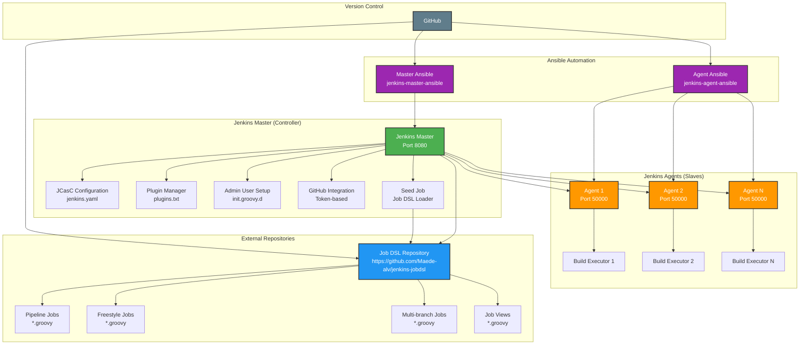

# Jenkins Architecture Diagram

## System Overview

This diagram illustrates the complete Jenkins automation architecture including the master controller, agents, and Job DSL repository integration.

## Component Details

### Jenkins Master (Controller)
- **Port**: 8080 (Web UI), 50000 (Agent communication)
- **Configuration**: JCasC (Jenkins Configuration as Code)
- **Plugins**: Managed via `plugins.txt` with specific versions
- **Admin**: Automated setup via Groovy init scripts
- **GitHub**: Token-based authentication for repository access

### Job DSL Repository
- **URL**: https://github.com/Maede-alv/jenkins-jobdsl
- **Purpose**: Infrastructure-as-code for Jenkins job definitions
- **Content**: Groovy scripts defining pipelines, freestyle jobs, and views
- **Integration**: Loaded via seed job on Jenkins master

### Jenkins Agents (Slaves)
- **Communication**: JNLP (Java Web Start) or SSH
- **Port**: 50000 (default agent port)
- **Purpose**: Distributed build execution
- **Management**: Automated via separate Ansible playbook

### Ansible Automation
- **Master Playbook**: `jenkins-master-ansible` - Deploys and configures Jenkins master
- **Agent Playbook**: `jenkins-agent-ansible` - Deploys and configures Jenkins agents
- **Configuration**: Declarative configuration management
- **Idempotency**: Safe to run multiple times

## Data Flow

1. **Initial Setup**: Ansible deploys Jenkins master with JCasC configuration
2. **Plugin Installation**: Jenkins installs plugins from `plugins.txt`
3. **Admin Setup**: Groovy init script creates admin user
4. **Seed Job Creation**: JCasC creates seed job for Job DSL loading
5. **Job Loading**: Seed job fetches and executes DSL scripts from repository
6. **Agent Connection**: Jenkins agents connect to master for build execution
7. **Build Execution**: Jobs run on available agents based on labels and resources

## Security Considerations

- **Authentication**: Local user authentication with admin setup
- **Authorization**: Logged-in users can do anything (configurable)
- **Credentials**: GitHub token stored securely in Jenkins credentials
- **Network**: Agent communication on dedicated port (50000)
- **SSH**: Key-based authentication for Ansible automation

## Scalability

- **Horizontal Scaling**: Add more agents as needed
- **Load Distribution**: Jobs distributed across available agents
- **Resource Management**: Agent labels for job routing
- **High Availability**: Master can be clustered (advanced setup) 