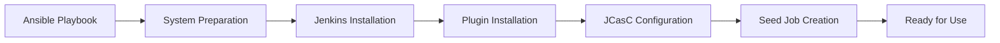
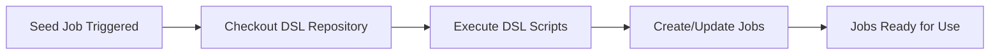

# Learning Jenkins Automation: Core Concepts Explained

*Understanding the fundamental concepts behind modern Jenkins infrastructure automation*

---

## 🧠 Understanding the Concepts

### What is Infrastructure as Code (IaC)?

**Infrastructure as Code** is the practice of managing and provisioning computing infrastructure through machine-readable definition files, rather than physical hardware configuration or interactive configuration tools.

**Why it matters for Jenkins:**
- **Reproducibility**: Deploy identical Jenkins environments anywhere
- **Version Control**: Track configuration changes in Git
- **Consistency**: Eliminate "works on my machine" problems
- **Automation**: Reduce manual configuration errors

**Example**: Instead of manually clicking through Jenkins UI to configure security, we define it in YAML:

```yaml
jenkins:
  securityRealm:
    local:
      allowsSignup: false
      users:
        - id: "admin"
          password: "secure-password"
```

### Jenkins Configuration as Code (JCasC)

**JCasC** is a Jenkins plugin that allows you to define Jenkins configuration in YAML format, treating configuration as code.

**Traditional vs JCasC Approach:**

| Traditional | JCasC |
|-------------|-------|
| Manual UI configuration | Declarative YAML files |
| Hard to reproduce | Version controlled |
| Environment drift | Consistent across environments |
| No audit trail | Full change history |

**Key Benefits:**
1. **Declarative**: Define what you want, not how to get it
2. **Version Controlled**: Track all configuration changes
3. **Environment Consistency**: Same config across dev/staging/prod
4. **Automated Deployment**: No manual configuration steps

### Job DSL (Domain Specific Language)

**Job DSL** is a Jenkins plugin that allows you to define Jenkins jobs using Groovy scripts, enabling job definitions as code.

**Why Job DSL?**
- **Bulk Job Management**: Create/update multiple jobs at once
- **Consistent Patterns**: Apply same job structure across projects
- **Version Control**: Track job changes in Git
- **Automation**: Generate jobs from templates

**Example Job DSL Script:**
```groovy
pipelineJob("my-app-pipeline") {
  description("Automated pipeline for My Application")
  definition {
    cps {
      script("""
        pipeline {
          agent any
          stages {
            stage('Build') {
              steps {
                echo 'Building application...'
              }
            }
            stage('Test') {
              steps {
                echo 'Running tests...'
              }
            }
          }
        }
      """.stripIndent())
      sandbox()
    }
  }
}
```

### Distributed Jenkins Architecture

**Master-Agent Pattern:**
- **Master (Controller)**: Orchestrates builds and manages configuration
- **Agents (Slaves)**: Execute actual build jobs

**Benefits:**
- **Scalability**: Add agents to handle more builds
- **Resource Isolation**: Separate build environments
- **Platform Flexibility**: Different agents for different platforms
- **Load Distribution**: Spread builds across multiple machines

---

## 🔄 The Automation Workflow

### 1. Ansible Deployment Process



**Step-by-Step Breakdown:**

1. **System Preparation**
   - Install Java and Git
   - Add Jenkins repository
   - Update package cache

2. **Jenkins Installation**
   - Install Jenkins with specific version
   - Create necessary directories
   - Configure systemd service

3. **Plugin Management**
   - Read plugins from `plugins.txt`
   - Install plugins with specific versions
   - Resolve dependencies automatically

4. **JCasC Configuration**
   - Deploy `jenkins.yaml` configuration
   - Set up security realm
   - Configure tools and credentials

5. **Seed Job Creation**
   - Create job that loads Job DSL scripts
   - Configure GitHub integration
   - Enable automated job management

### 2. Job DSL Loading Process



**How it works:**
1. **Seed Job Runs**: Either manually or automatically
2. **Repository Checkout**: Fetches latest DSL scripts from Git
3. **Script Execution**: Processes all `.groovy` files in `jobs/` directory
4. **Job Creation**: Creates or updates Jenkins jobs based on DSL definitions
5. **Cleanup**: Removes jobs that no longer exist in DSL scripts

---

## 🛠️ Key Technologies Explained

### Ansible

**What is Ansible?**
Ansible is an open-source automation tool that automates software provisioning, configuration management, and application deployment.

**Why Ansible for Jenkins?**
- **Agentless**: No software needed on target machines
- **Declarative**: Define desired state, not steps
- **Idempotent**: Safe to run multiple times
- **YAML-based**: Human-readable configuration

**Key Concepts:**
- **Playbooks**: YAML files defining automation tasks
- **Roles**: Reusable automation components
- **Inventory**: List of target machines
- **Variables**: Configuration data

### YAML Configuration

**YAML (YAML Ain't Markup Language)** is a human-readable data serialization format used for configuration files.

**Why YAML?**
- **Readable**: Easy for humans to understand
- **Structured**: Clear hierarchy and relationships
- **Standard**: Widely adopted in DevOps tools
- **Flexible**: Supports complex data structures

**Example JCasC Configuration:**
```yaml
jenkins:
  systemMessage: "Jenkins Configured via Ansible and JCasC"
  numExecutors: 2
  mode: EXCLUSIVE
  securityRealm:
    local:
      allowsSignup: false
      users:
        - id: "admin"
          password: "secure-password"
```

### Groovy Scripting

**Groovy** is a powerful, optionally typed and dynamic language for the Java platform.

**Why Groovy for Job DSL?**
- **Java Compatibility**: Runs on JVM
- **Dynamic Typing**: Flexible scripting
- **DSL Support**: Perfect for domain-specific languages
- **Jenkins Integration**: Native support in Jenkins

**Job DSL Example:**
```groovy
// Create a pipeline job
pipelineJob("my-pipeline") {
  description("My automated pipeline")
  definition {
    cps {
      script(pipelineScript)
      sandbox()
    }
  }
  triggers {
    scm('H/5 * * * *')  // Poll SCM every 5 minutes
  }
}
```

---

## 🎯 Best Practices

### 1. Configuration Management

**Centralize Configuration:**
```yaml
# vars/config.yml
jenkins_version: "2.516.1"
jenkins_admin_username: "admin"
github_token: "{{ vault_github_token }}"
```

**Use Ansible Vault for Secrets:**
```bash
ansible-vault encrypt_string 'your-secret-password' --name jenkins_admin_password
```

### 2. Plugin Management

**Version Pinning:**
```txt
# files/plugins.txt
git:5.7.0
job-dsl:1.93
pipeline-build-step:571.v08a_fffd4b_0ce
```

**Why specific versions?**
- **Reproducibility**: Same behavior across environments
- **Stability**: Avoid breaking changes
- **Rollback**: Easy to revert if needed

### 3. Security Considerations

**Credential Management:**
```yaml
credentials:
  system:
    domainCredentials:
      - credentials:
          - usernamePassword:
              scope: GLOBAL
              id: "git-token"
              username: "{{ github_username }}"
              password: "{{ github_token }}"
```

**Network Security:**
- **HTTPS**: Use SSL/TLS in production
- **Firewall**: Restrict access to Jenkins ports
- **Authentication**: Implement proper user management

### 4. Scalability Patterns

**Agent Management:**
- **Labels**: Use labels to route jobs to specific agents
- **Resource Allocation**: Distribute load across agents
- **Auto-scaling**: Add/remove agents based on demand

**Job Organization:**
- **Folders**: Organize jobs in logical folders
- **Templates**: Use Job DSL templates for consistency
- **Views**: Create custom views for different teams

---

## 🔍 Debugging and Troubleshooting

### Common Issues

**1. Jenkins Won't Start**
```bash
# Check service status
sudo systemctl status jenkins

# View logs
sudo journalctl -u jenkins -f

# Check Java installation
java -version
```

**2. Plugin Installation Fails**
- Verify internet connectivity
- Check plugin version compatibility
- Review Jenkins logs for specific errors

**3. Job DSL Scripts Fail**
- Validate Groovy syntax
- Check GitHub token permissions
- Review seed job logs

**4. Agents Can't Connect**
- Verify network connectivity
- Check agent configuration
- Review master logs for connection attempts

### Debugging Tools

**Ansible Debugging:**
```bash
# Run with verbose output
ansible-playbook -i inventory/hosts.yml playbook.yml -vvv

# Check connectivity
ansible all -i inventory/hosts.yml -m ping
```

**Jenkins Debugging:**
- **System Information**: Manage Jenkins → System Information
- **System Log**: Manage Jenkins → System Log
- **Job Logs**: Individual job build logs

---

## 📚 Further Learning

### Recommended Reading

1. **Jenkins User Handbook**: Official Jenkins documentation
2. **Ansible Documentation**: Complete Ansible reference
3. **JCasC Plugin**: Configuration as Code documentation
4. **Job DSL Plugin**: Job DSL reference and examples

### Hands-On Practice

1. **Deploy Jenkins**: Use this playbook to deploy your first instance
2. **Customize Jobs**: Modify Job DSL scripts for your projects
3. **Add Agents**: Deploy Jenkins agents using the agent playbook
4. **Implement Pipelines**: Create CI/CD pipelines for your applications

### Community Resources

- **Jenkins Community**: Forums and mailing lists
- **Ansible Community**: Community-driven content and examples
- **GitHub**: Open source projects and examples
- **Stack Overflow**: Q&A for specific issues

---

*Remember: The best way to learn is by doing. Start with a simple deployment and gradually add complexity as you become more comfortable with the concepts.* 